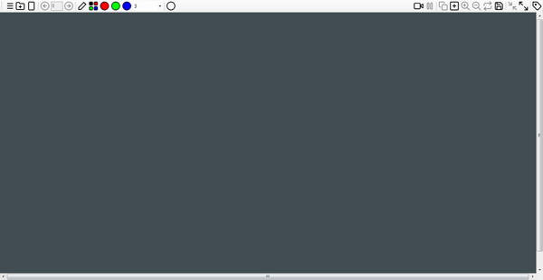

# Smart Board App

Smart Board App (with Microsoft.Expression.Encoder) - 2015 (C#)

Smart Board App is a free image editing software that runs on Windows PC platform. This program is very simple to use and developed with a simple design.

By opening all the pictures in the folder you want to open, you can select and open images one by one or simply you can paste the image that you copied before. You can edit images with the colorful pen tools also you can zoom in / out, rotate. And finally you can copy or save the images you edited.

One of the most important feature of this program is, transparent screen and with this feature you can edit whatever you want to, any page on your screen. You can also remove this feature and reach to desktop with Big View button on the right top without close the app. Small View button returns default settings.

Other important feature of this program is capture the workspace. This feature uses <a href="https://www.microsoft.com/en-us/download/details.aspx?id=18974">Microsoft Expression Encoder</a>.

Smart Board App doesn't require installation.

<a href="https://github.com/onursert/SmartBoardApp/raw/master/SmartBoardApp.zip">Download Smart Board App</a>
<a href="https://github.com/onursert/SmartBoardApp/raw/master/SmartBoardApp_v5.zip">Download Smart Board App v5</a>
